# Healthy Reentry

This guide assumes you are familiar with the basic setup as described in the [README](../README.md).  

## Backend Setup
The backend is a node app running an express server for the API.  
Detailed information about the models ard routes are documented as swagger annotated code comments.  
## Models 
The information is represented via database 3 models stored in `/server/models`.  
- Encounter
- Status
- User
## Routes
The front end triggers updates to stored data via REST calls made to the backend stored in `/server/routes`.  
The routes serve or update information pertaining to specific models under similar named paths.  
The admin routes are special and accessible only to users marked as admin for their organization.  
The routes utilize the utility methods stored in `/server/lib` for the graph basic logic.  

## Front End Setup
Front end is made as a progressive web app using Vue framework.  
It uses the following libraries:
- [axios](https://github.com/axios/axios) for client side HTTP requests.  
- [Vuex](https://vuex.vuejs.org/) for client-side data store.  
- [VueQrcodeReader](https://www.npmjs.com/package/vue-qrcode-reader) for QR code support.  
- [FontAwesome](https://fontawesome.com) for fonts and icons.  
- [VueMaterial](https://vuematerial.io/) and [Bootstrap](https://getbootstrap.com) for themes and styles.  
A custom defined auth plugin is a wrapper around Auth0 to manage user authentication and authorization in the app.  
It's designed to allow being installed as a basic[Progressive Web App](https://en.wikipedia.org/wiki/Progressive_web_application).  

## Populate the .env file
### Update the port
On the dev setup the port value from the env file runs the backend api service, with port+1 running the server for front-end client and the backend calls are proxied over to the backend service.  
In production the front end and backend is run from the same port as specified in the env file.  

### Setup Auth0
- Sign up with [Auth0](https://auth0.com/signup).  
- Click on 'CREATE APPLICATION'.  

- Give the app a name of your choosing. Remember this, we will need it soon. Select 'Single Page Web Application' for application type.  
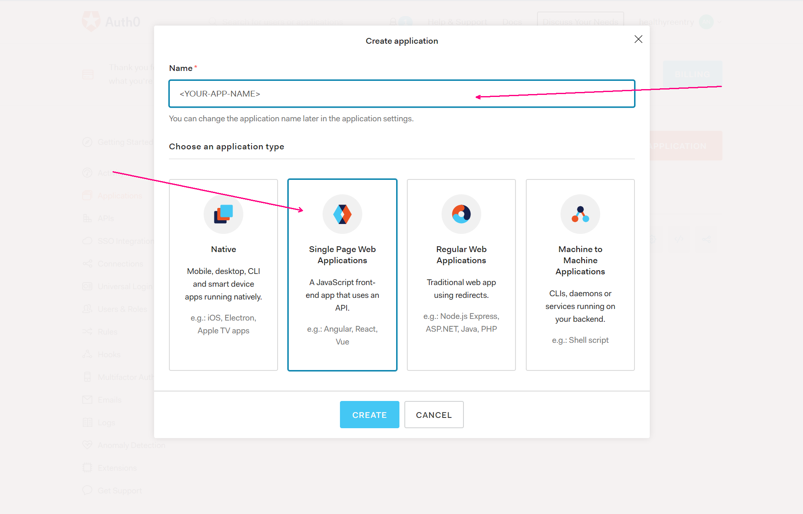
- Go to the 'App Settings' tab and copy the 'Domain' and 'Client ID'. These will be the `AUTH0_DOMAIN` and `AUTH0_CLIENT_ID` in the env file.  
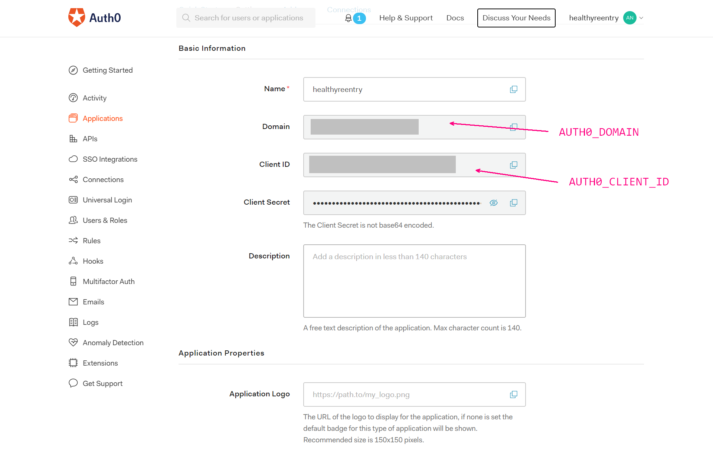
- Add all URLs your app would be running on (including development ones) to these 3 text boxes (comma seperated, no slashes at the end).  
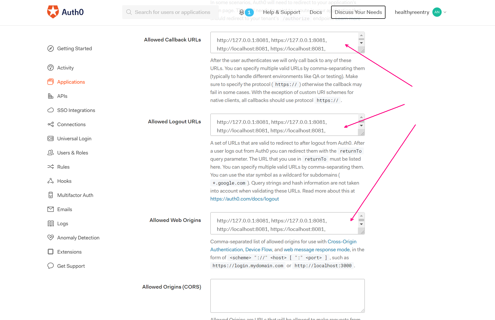
- Use the following format to update `AUTH0_JWKS_URI` and `AUTH0_TOKEN_ISSUER` in the env.
```
AUTH0_JWKS_URI: https://<YOUR-APP-NAME>.auth0.com/.well-known/jwks.json
AUTH0_TOKEN_ISSUER: https://<YOUR-APP-NAME>.auth0.com/
```
- The complete setup for auth0 is now complete and should look something like this. If you have trouble please reach out to the dev team.  
```
AUTH0_DOMAIN=<YOUR-APP-NAME>.auth0.com
AUTH0_CLIENT_ID=<RANDOM-STRING-OF-32-CHARACTERS>
AUTH0_JWKS_URI=https://<YOUR-APP-NAME>.auth0.com/.well-known/jwks.json
AUTH0_TOKEN_ISSUER=https://<YOUR-APP-NAME>.auth0.com/
```


### Setup MongoDB Atlas
- Sign up at [MongoDB Atlas](https://account.mongodb.com/account/register).  
- Click on 'New Project'.
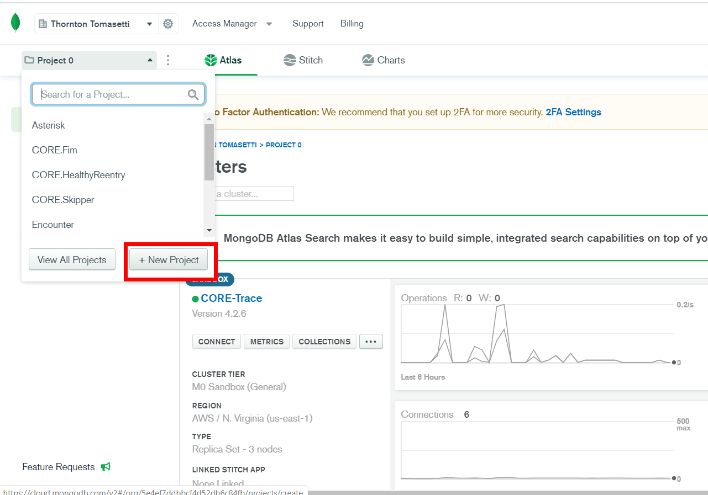
- Create a new project with a name you desire
- Once the project is created, create a new cluster  
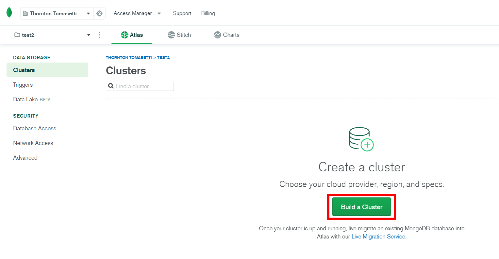
- Create a new cluster that will host your data.
- Click on "Connect"
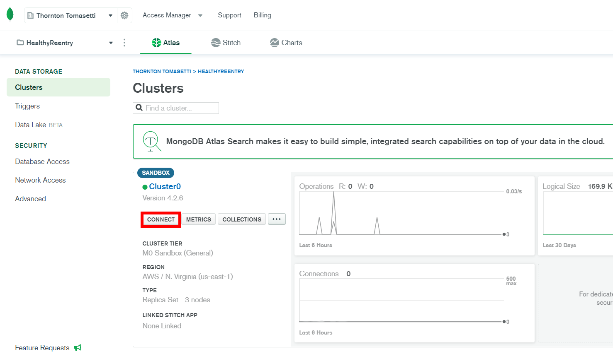
- Go to "Setup connection security" tab
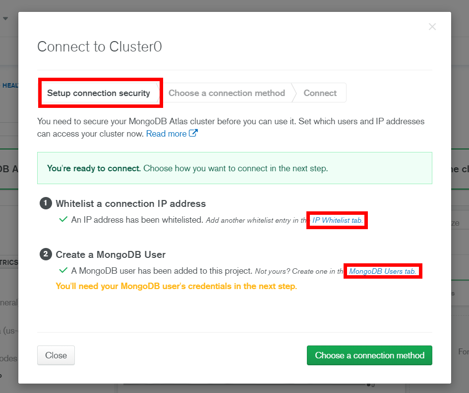
  1. Whitelist a connection IP address
    - Select "ADD CURRENT IP ADDRESS" for local testing, or use "0.0.0.0/0" for production deployment
  
  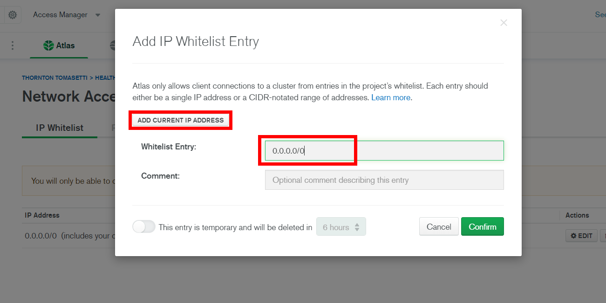

  2. Create a MongoDB User
    - Create a new database user with specific access
  
  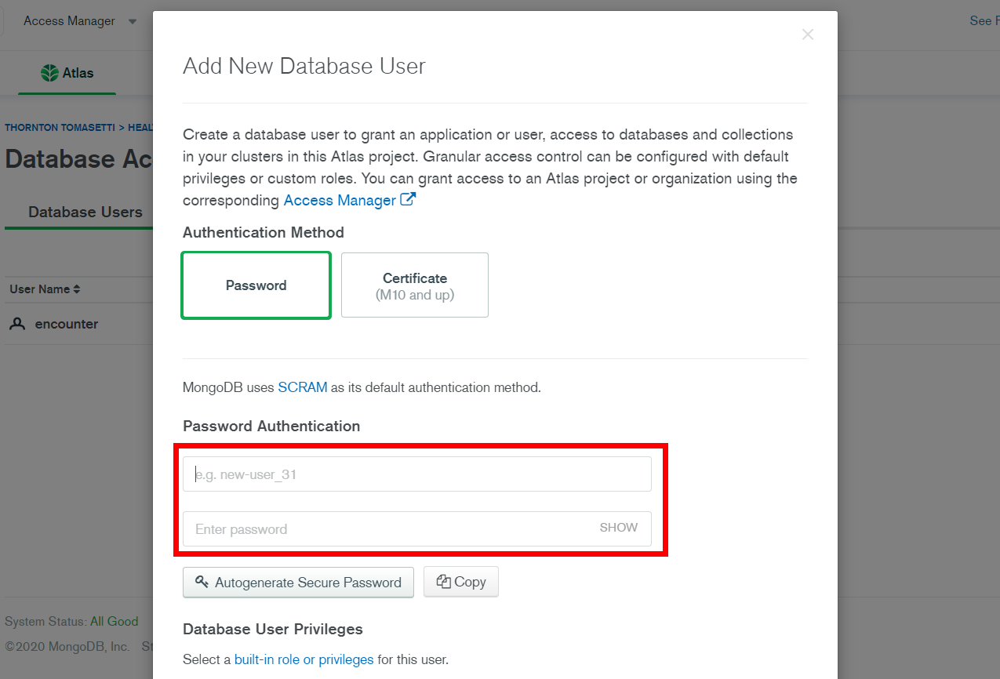


- Navigate back to cluster connection modal, go to "Choose a connection method" tab, then click on "Connection your application"
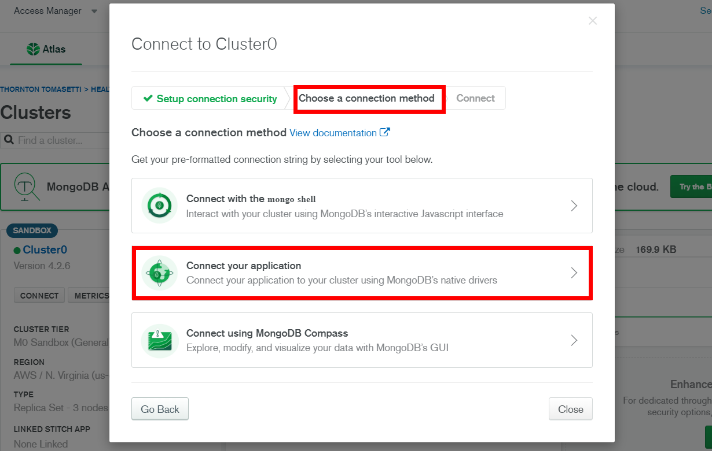
- Choose Node.js as your driver, and use the driver code example below in your .env file as the "MONGO_URL". Replace the keywords in the example with your DB username and password.
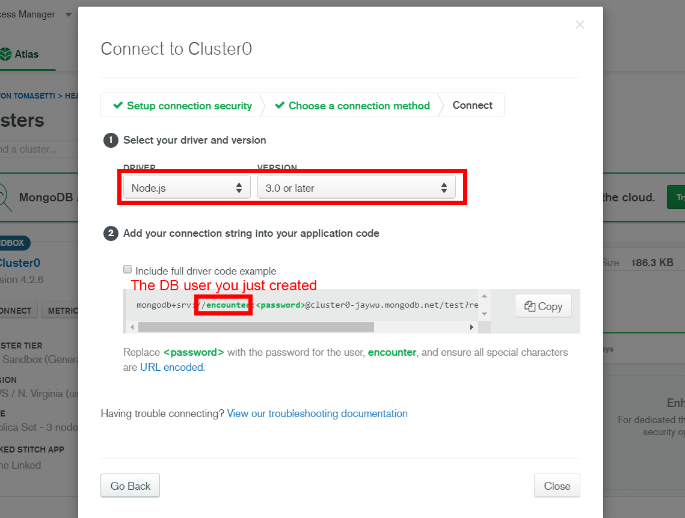


### Setup SendGrid Service
- Sign up at [SendGrid](https://signup.sendgrid.com/).  
- Create an account and verify your email address
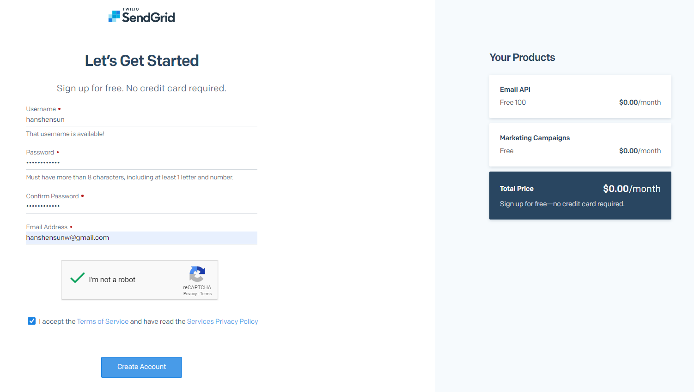
- Once you are logged in, go to ["Single Sender Verification"](https://app.sendgrid.com/settings/sender_auth/senders/new), then setup a sender with your company info and the email address you desire to send out notifications.
- After the new sender is setup, you will receive another verification email in your inbox.
- Once verified, go to "API Key" section under "Settings" on the left, then click on "Create API Key"
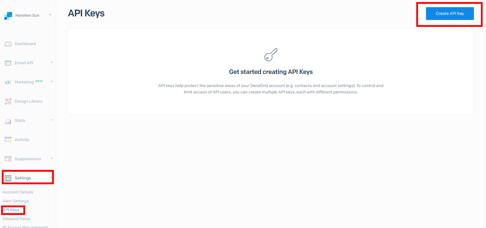
- Name the API key as you desire, then choose "Full Access" under "API Key Permissions" section.
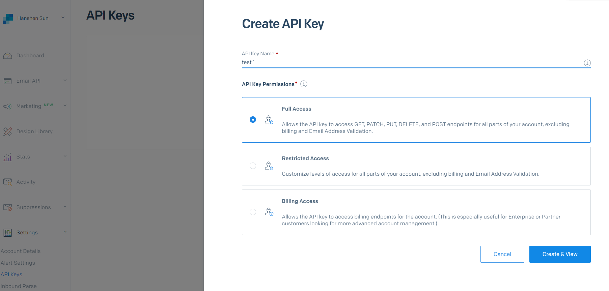
- After clicking "Create & View", your API Key should show up on the screen. Save this API Key and put it in your .env file under (SENDGRID_API_KEY=)
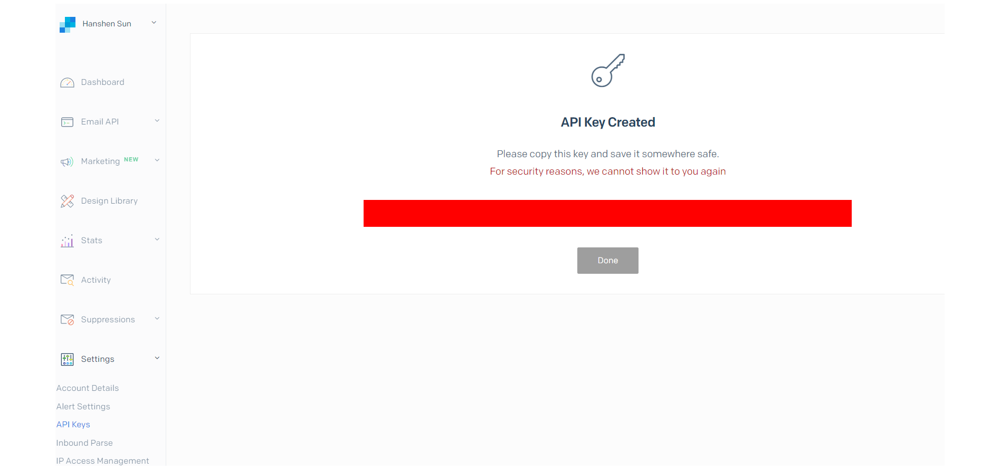
- Please also use the email of the SendGrid sender you created in the .env file, under (SENDGRID_EMAIL =)
