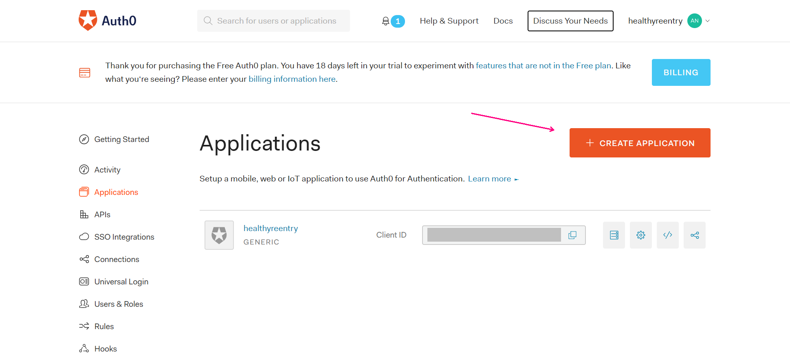

# Healthy Reentry

This guide assumes you are familiar with the basic setup as described in the [README](../README.md).  

## Backend Setup

## Front End Setup

## Populate the .env file
### Update the port
On the dev setup the port value from the env file runs the backend api service, with port+1 running the server for front-end client and the backend calls are proxied over to the backend service.  
In production the front end and backend is run from the same port as specified in the env file.  

### Setup Auth0
- Sign up with [Auth0](https://auth0.com/signup).  
- Click on 'CREATE APPLICATION'.  

- Give the app a name of your choosing. Remember this, we will need it soon. Select 'Single Page Web Application' for application type.  

- Go to the 'App Settings' tab and copy the 'Domain' and 'Client ID'. These will be the `AUTH0_DOMAIN` and `AUTH0_CLIENT_ID` in the env file.  

- Add all URLs your app would be running on (including development ones) to these 3 text boxes (comma seperated, no slashes at the end).  

- Use the following format to update `AUTH0_JWKS_URI` and `AUTH0_TOKEN_ISSUER` in the env.
```
AUTH0_JWKS_URI: https://<YOUR-APP-NAME>.auth0.com/.well-known/jwks.json
AUTH0_TOKEN_ISSUER: https://<YOUR-APP-NAME>.auth0.com/
```
- The complete setup for auth0 is now complete and should look something like this. If you have trouble please reach out to the dev team.  
```
AUTH0_DOMAIN=<YOUR-APP-NAME>.auth0.com
AUTH0_CLIENT_ID=<RANDOM-STRING-OF-32-CHARACTERS>

AUTH0_JWKS_URI=https://<YOUR-APP-NAME>.auth0.com/.well-known/jwks.json
AUTH0_TOKEN_ISSUER=https://<YOUR-APP-NAME>.auth0.com/
```

### Get SendGrid credentials

### Get MongoDB credentials

